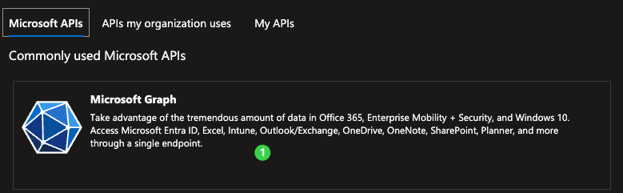
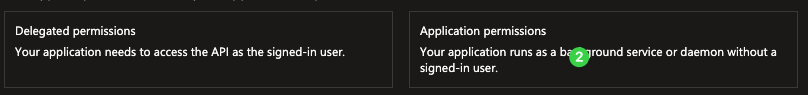
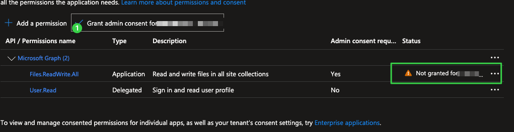
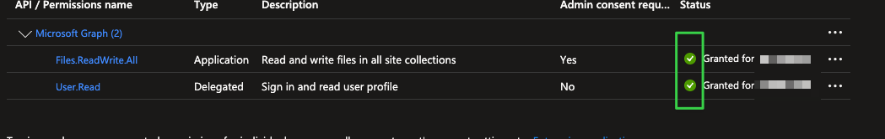
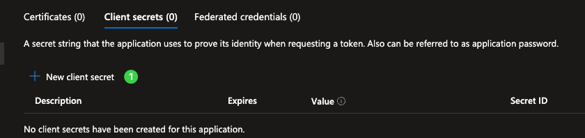
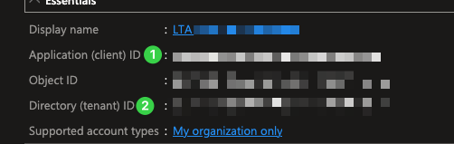

# Application Registration Guide (Azure AD)

## Overview

This document explains the process of registering a new application in Azure Active Directory (AD), configuring permissions, and generating credentials.

## Steps

### 1. Create a New Application

- Go to **Azure Portal** → **Azure AD** → **App Registrations**.
- Click **"New Registration"**.
- Enter a name for your application.
- Select **"Single Tenant"** for supported account types.
- Choose **Web** as the redirection URL type.

### 2. Configure API Permissions

- In your application, go to **"API Permissions"**.
- Click **"Add a permission" ①** 

- Select **"Microsoft Graph"**.
- Choose **"Application permissions" ②**.

- Search and select the following permission: ③
- `Files.ReadWrite.All`

- Click **"Add permissions"**.
- Grant the permissions by clicking **"Grant admin consent"**.

### 3. Generate Client Secret

- Go to **"Certificates & Secrets"** in the left navigation.
- Click **"New client secret" ①**.

- Provide a description and select an expiration period.
- Click **"Add"**.
- Copy and securely store the secret value displayed.

> **Important:** The client secret value is displayed only once after creation.

### 4. Retrieve Application IDs

- Navigate to the **"Overview"** page of your application.
- Copy and securely store:
  - **Application (Client ID) ②**
  - **Directory (Tenant ID) ①**
  
  

---

## Credentials Summary (Keep Securely)

| Credential             | Value                  |
|------------------------|------------------------|
| **Tenant ID**          | `<your-tenant-id>`     |
| **Application ID**     | `<your-client-id>`     |
| **Client Secret**      | `<your-client-secret>` |

Replace placeholders with your actual credentials.

---

**Note:** Ensure these credentials are stored securely and not shared publicly.

