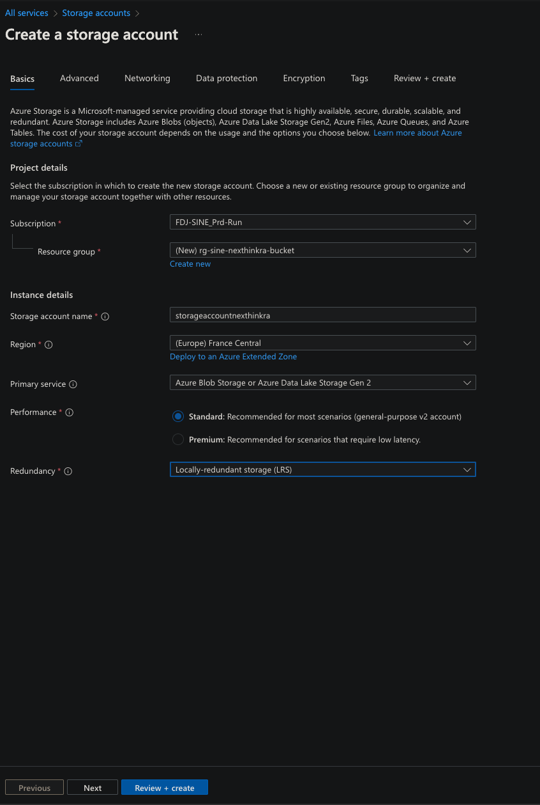
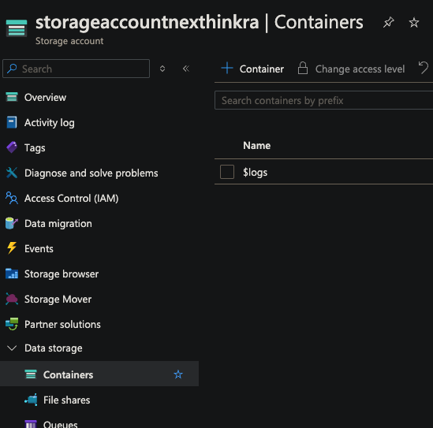
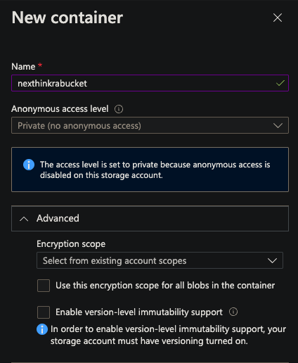
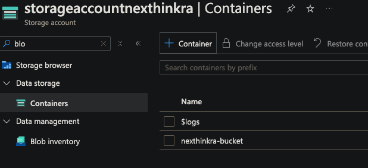
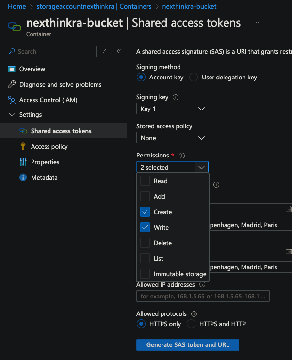
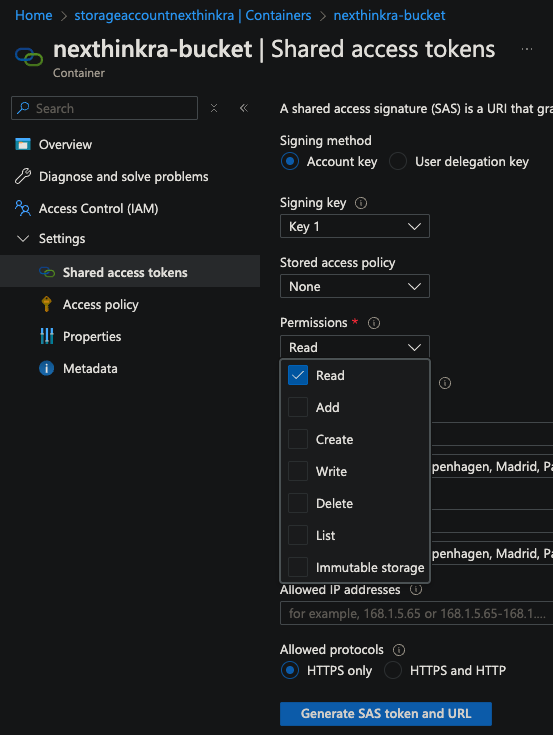

# 📦 Azure Blob Storage Configuration Guide

## Overview

This guide outlines the complete process of configuring Azure Blob Storage to be used with the Remote Action file upload feature. It covers the creation of the storage account, container setup, and generation of SAS (Shared Access Signature) tokens for secure file upload and download.

---

## 1️⃣ Create a New Storage Account

1. Log in to the [Azure Portal](https://portal.azure.com/).
2. Navigate to **Storage accounts**.
3. Click **"Create"**.
4. Select your **Subscription**.
5. Create or select an existing **Resource Group**.
6. Enter a unique **Storage account name**.
7. Select the **Region** closest to your users.
8. Choose the following settings:
   - **Performance**: Standard
   - **Redundancy**: Locally-redundant storage (LRS)
   - **Account kind**: StorageV2 (general-purpose v2)
9. Click **"Review + create"**, then **"Create"**.

---

## 2️⃣ Create a Blob Container

1. Once the storage account is created, go to the storage account dashboard.
2. In the **Data storage** section, click **"Containers"**.
3. Click **"+ Container"**.
4. Enter a **Container name** (e.g., `nexthinkra-bucket`).
5. Set **Public access level** to `Private (no anonymous access)`.
6. Click **"Create"**.

---

## 3️⃣ Generate SAS Upload Token

1. Go to the **container** you just created.
2. Click **"Shared access tokens"** in the left-hand menu.
3. Under **Permissions**, enable the following for upload:
   - **Write**
   - **Create**
4. Set an **Expiration date and time** according to your needs.
5. Click **"Generate SAS token and URL"**.
6. Copy and securely store the **Blob SAS token**.

> ⚠️ **Important:** The SAS token must be securely stored. It is only shown once.

---

## 4️⃣ Generate SAS Download Token

1. Repeat the steps from the previous section.
2. This time, enable only the **Read** permission.
3. Set a different **Expiration date**, if needed.
4. Click **"Generate SAS token and URL"**.
5. Store the **Blob SAS token** for downloading purposes.

---

## 🔐 Credentials Summary

| Credential              | Description                                         |
|------------------------|-----------------------------------------------------|
| **SAS Upload Token**    | Token allowing write access to upload files        |
| **SAS Download Token**  | Token allowing read access to download files       |

---

## ✅ Notes

- Always use **HTTPS** when using SAS URLs.
- You can provide separate SAS tokens for upload and download operations to limit access scopes.
- Tokens can be regenerated at any time if compromised.
- Never share your tokens publicly.
